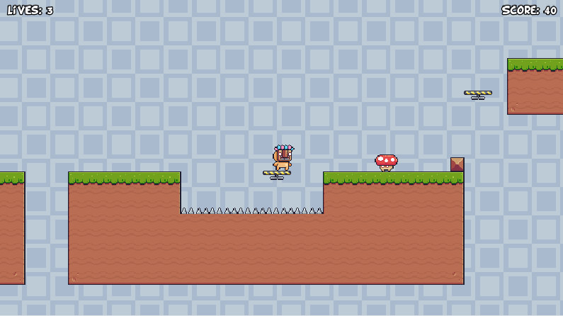
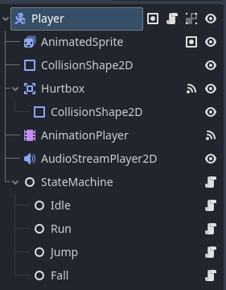

# Super Platformer 2D Platformer in Godot 4

## 🎮 Sobre el Proyecto
Este proyecto es un plataformas 2D desarrollado en Godot 4.4 utilizando GDScript. 
El objetivo principal fue implementar una arquitectura de software escalable y robusta, aplicando principios de Ingeniería de Software.
El juego cuenta con sistema de niveles, persistencia de datos (High Score), audio manager y mecánicas de "Game Feel" avanzadas.

## ⚙️ Aspectos Técnicos Destacados
Lo más valioso de este proyecto es la estructura del código, diseñada para ser mantenible y escalable.

### Arquitectura FSM (Máquina de Estados Finita)
* **Desacoplamiento:** Lógica del jugador separada en nodos independientes (`Idle`, `Run`, `Jump`, `Fall`) para máxima escalabilidad.
* **Sistema de Eventos:** Uso de `Signals` para comunicar UI, Player y Enemigos sin dependencias rígidas.

*Estructura de nodos del Player mostrando la StateMachine y sus estados.*

### 🕹️ Game Feel (Jugabilidad)
* **Coyote Time:** Implementación de ventana de tiempo post-plataforma.
* **Jump Buffering:** Cola de inputs para saltos precisos.
* **Variable Jump Height:** Control físico total sobre la altura del salto.

### Patrones de Diseño Aplicados
* **Singleton:** Utilizado en `GameManager` (control de flujo) y `AudioManager` (sonido persistente).
* **Observer:** Comunicación mediante señales para evitar "Spaghetti Code".
* **Composition:** Uso de nodos hijos (`Hurtbox`, `StateMachine`) para agregar funcionalidades de forma modular.

## 🛠️ Tecnologías Usadas
* **Engine:** Godot 4.4 (GDScript)
* **Patrones:** Singleton, State, Observer, Component.
* **Persistencia:** Sistema de guardado JSON/Binario para High Scores.

---
*Este proyecto es parte de mi portafolio como desarrollador de software.*

